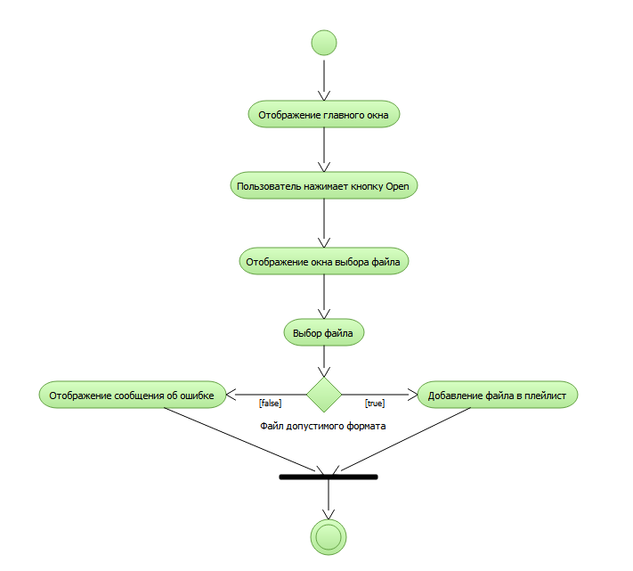
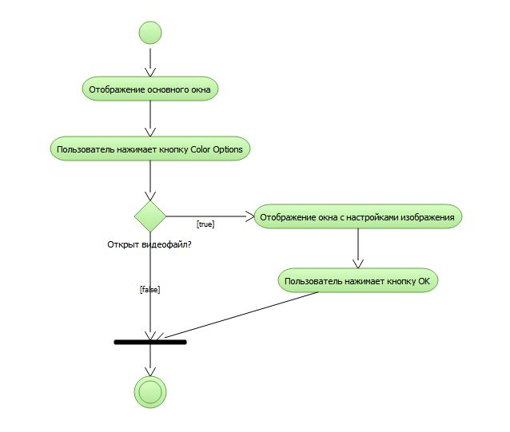
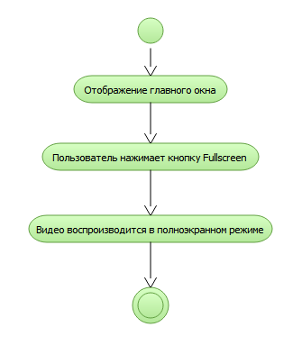
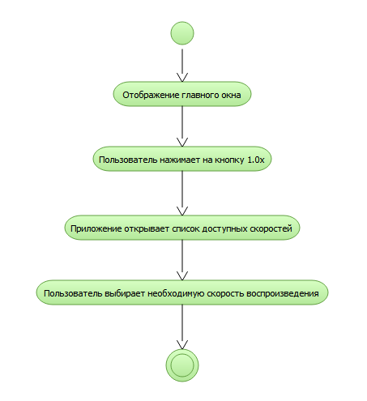

# Диаграммы деятельности
---

# Содержание
1. [Открытие файла](#1)
2. [Корректировка изображения видео](#2)
3. [Управление полноэкранным режимом](#3)
4. [Управление скоростью воспроизведения](#4)

### 1. Открытие файла
При открытии файла пользователь видит окно медиаплеера, где пользователь нажимает кнопку Open. После этого приложение отображает окно для поиска файла в файловой системе. При нажатии кнопки Открыть приложение пытается открыть файл. При успешном открытии файл добавляется в плейлист.

### 2. Корректировка изображения видео
При нажатии на кнопку Color Options приложение открывает окно для управления изображением видео. При нажатии кнопки OK настройки применяются и окно закрывается.

### 3. Управление полноэкранным режимом
Пользователь нажимает кнопку Fullscreen и видеофайл воспроизводится в полноэкранном режиме.

### 4. Управление скоростью воспроизведения
При нажатии на кнопку 1.0x приложение открывает элемент графического интерфейса listbox, в котором пользователь выбирает одно из 3 предустановленных значений скорости воспроизведения.

