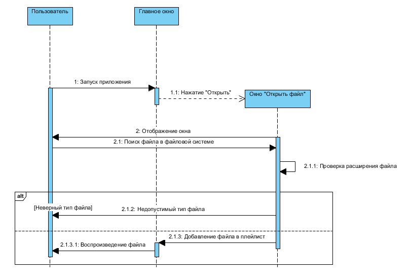
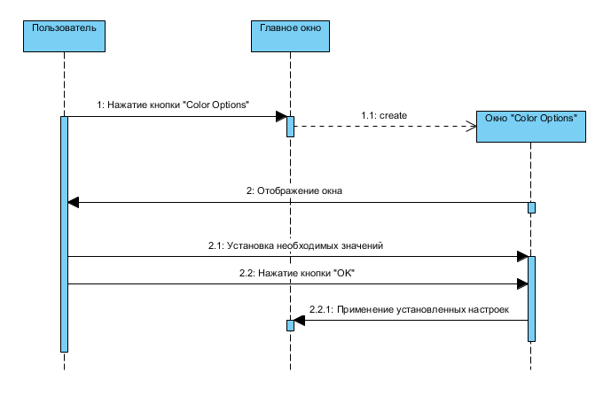
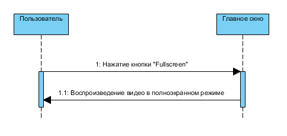
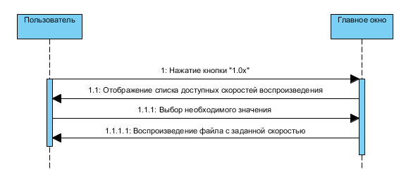

# Диаграммы последовательности
---

#Содержание
1. [Открытие файла](#1)
2. [Корректировка изображения видео](#2)
3. [Управление полноэкранным режимом](#3)
4. [Управление скоростью воспроизведения](#4)

### 1. Открытие файла

### 2. Корректировка изображения видео

### 3. Управление полноэкранным режимом

### 4. Управление скоростью воспроизведения

