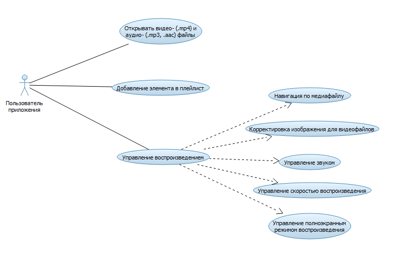

# Поток событий
---

# Содержание
1 [Актёры](#1)  
2 [Варианты использования](#2)  
2.1 [Открытие медиафайлов](#2.1)  
2.2 [Добавление элемента в плейлист](#2.2)  
2.3 [Управление воспроизведением](#2.3)  
2.4 [Навигация по медиафайлу](#2.4)  
2.5 [Корректировка изображения для видеофайлов](#2.5)  
2.6 [Управление уровнем звука](#2.6)  
2.7 [Управление скоростью воспроизведения](#2.7)  
2.8 [Управление полноэкранным режимом воспроизведения](#2.8)  
<a name="1"/>

# 1 Актёры

| Актёр | Описание |
|:--|:--|
| Пользователь приложения | Человек, имеющий базовые навыки работы с компьютером. |

<a name="2"/>

# 2 Варианты использования

<a name="2.1"/>

## 2.1 Открытие медиафайлов.

**Описание.** Вариант использования "Открытие медиафайлов" позволяет пользователю открывать медиафайлы в приложении QtMediaPlayer".  

**Основной поток.**
1. Вариант использования начинается, когда пользователь нажимает кнопку Открыть;
2. Приложение выводит экран окно для навигации по файловой системе и поиска необходимого файла;
3. Пользователь нажимает кнопку "Открыть";
4. Приложение пытается открыть файл. Если файл недопустимого формата, приложение уведомляет пользователя об этом;
5. Вариант использования завершается;

<a name="2.2"/>

## 2.2 Добавление элемента в плейлист

**Описание.** Вариант использования "Добавление заметки" позволяет пользователю добавить элемент в плейлист.  

**Основной поток.**
1. Пользователь открывает файл;
2. Приложение автоматически добавляет открытый файл в плейлист;
3. Вариант использования завершается;

<a name="2.3"/>

## 2.3 Управление воспроизведением

**Описание.** Вариант использования "Управление воспроизведением" позволяет пользователю управлять настройками воспроизведения файлов.

**Основной поток.**
1. Пользователь открывает файл;
2. Пользователь управляет настройками воспроизведения;
3. Вариант использования завершается;

<a name="2.4"/>

## 2.4 Навигация по медиафайлу

**Описание.** Вариант использования "Навигация по медиафайлу" позволяет управлять позицией в файле для начала воспроизведения.  

**Основной поток.**
1. Пользователь открывает файл;
2. Пользователь перемещает ползунок навигации по файлу в требуемое место;
3. Приложение начинает воспроизведение с выбранной позиции;
4. Вариант использования завершается;

<a name="2.5"/>

## 2.5 Корректировка изображения для видеофайлов

**Описание.** Вариант использования "Корректировка изображения для видеофайлов" позволяет отредактировать изображение для видеофайлов.  
**Предусловие.** Пользователь открыл видеофайл.

**Основной поток.**
1. Пользователь нажимает кнопку Color Options;
2. Приложение выводит окно управления цветом;
3. Пользователь с помощью элементов управления настраивает необходимые уровни яркости, контрастности, оттенка и насыщенности изображения;
4. Пользователь нажимает кнопку ОК;
5. Вариант использования завершается.

<a name="2.6"/>

## 2.6 Управление уровнем звука

**Описание.** Вариант использования "Управление уровнем звука" позволяет изменять уровень громкости звучания.

**Основной поток.**
1. Пользователь открывает файл;
2. Пользователь с помощью специального элемента управления изменяет уровень громкости;
3. Вариант использования завершается;

<a name="2.7"/>

## 2.7 Управление скоростью воспроизведения

**Описание.** Вариант использования "Управление скоростью воспроизведения" позволяет пользователю установить одну из трех скоростей воспроизведения.

**Основной поток.**
1. Пользователь нажимает на ComboBox "1.0x";
2. Пользователь устанавливает необходимое значение скорости;
3. Приложение изменяет скорость воспроизведения;
4. Вариант использования завершается.

<a name="2.8"/>

## 2.8 Управление полноэкранным режимом воспроизведения

**Описание.** Вариант использования "Управление полноэкранным режимом воспроизведения" позволяет выбрать полноэкранный режим воспроизведения.

**Основной поток.**
1. Пользователь открывает видеофайл;
2. Пользователь нажимает на кнопку FullScreen;
3. Приложение открывает видео в полноэкранном режиме;
3. Вариант использования завершается;